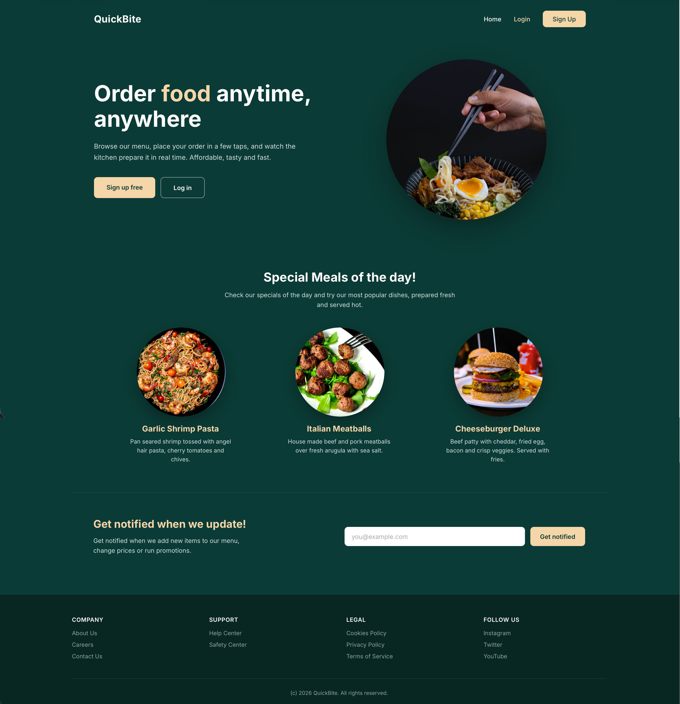
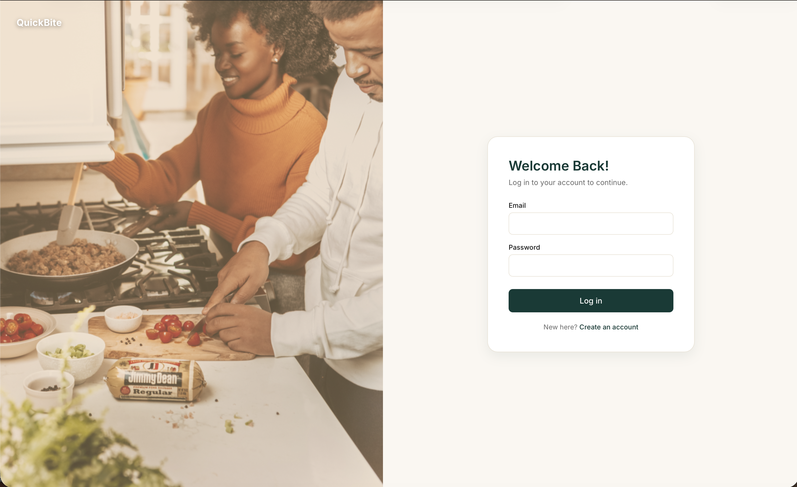
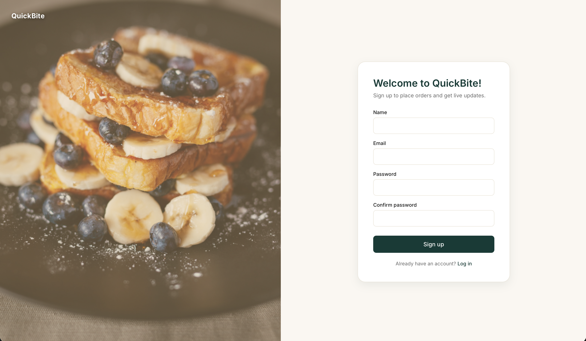
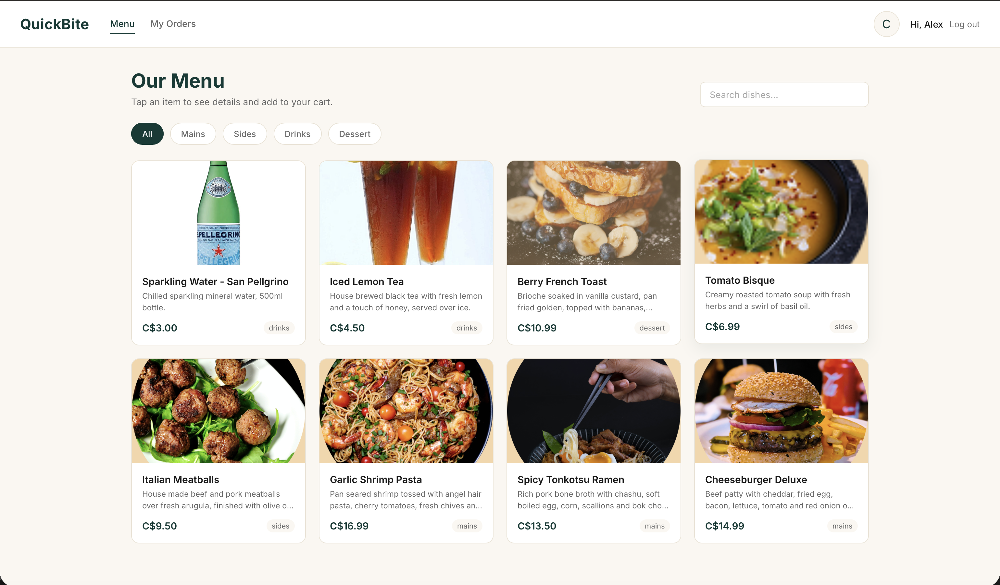
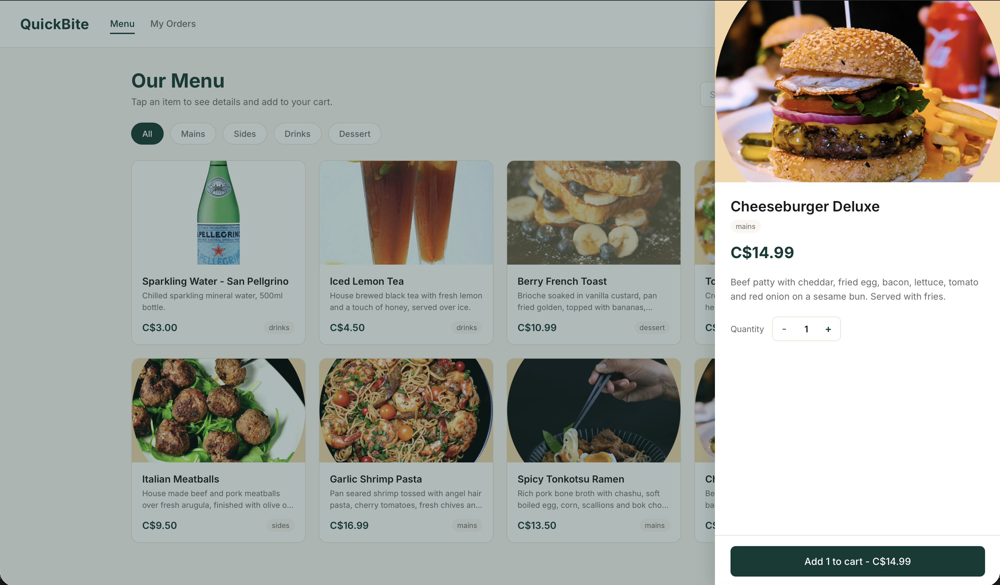
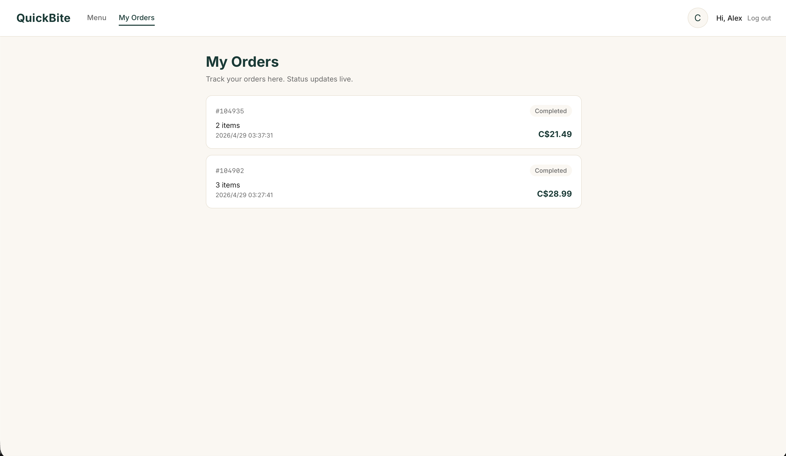
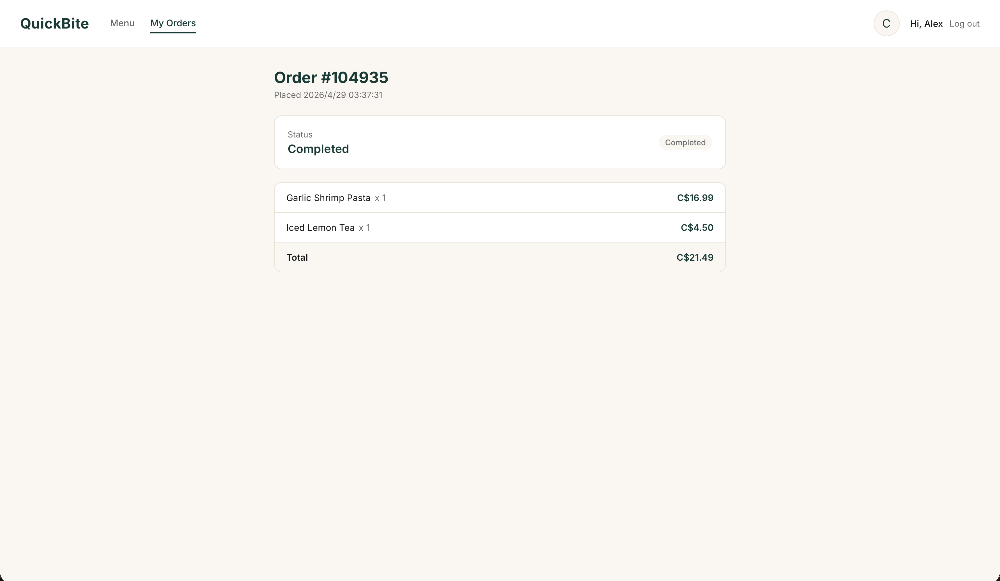
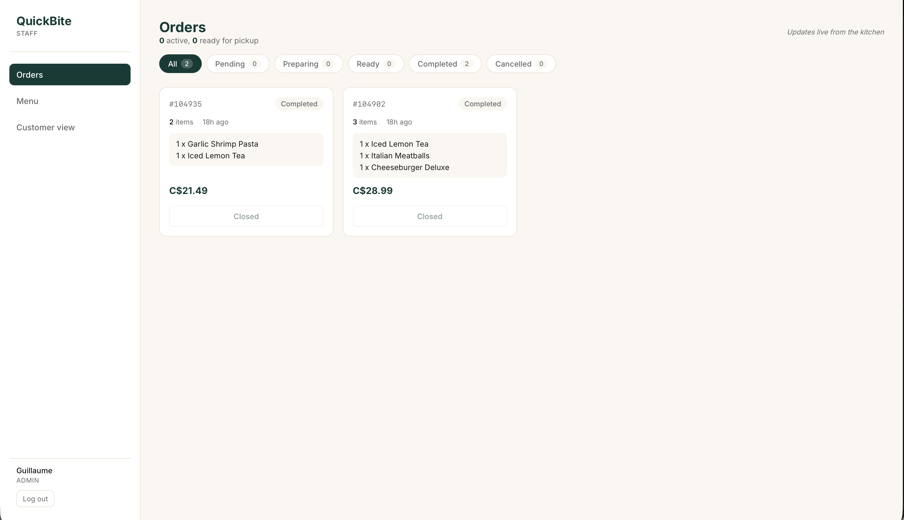
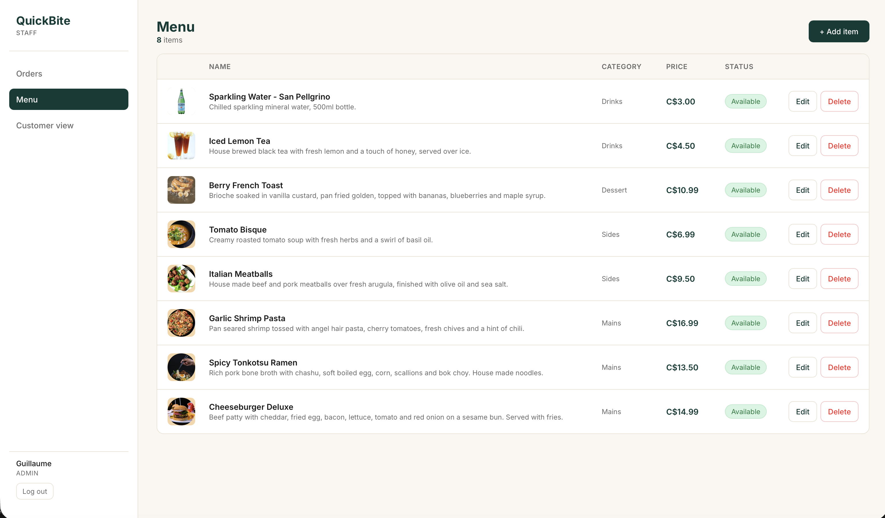
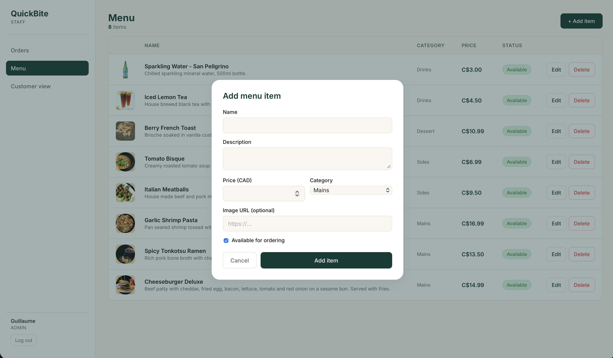

# QuickBite

A full-stack restaurant ordering web app with real-time order tracking, role based access for customers and staff, and live kitchen updates over WebSocket.

Built as the final project for Trends in Technology W2026.



## Tech Stack

**Backend**
- Node.js, Express
- MongoDB Atlas with Mongoose
- Socket.IO for live order updates
- JSON Web Tokens for auth
- bcryptjs for password hashing

**Frontend**
- React 18 with Vite
- React Router for client side routing
- Axios for the REST API
- Socket.IO client for live updates
- Plain CSS with design tokens, no UI framework

**Deployment**
- Render Web Service for the backend
- Render Static Site for the frontend

## Features

### Public landing page
The landing page is a marketing entry point with a hero, three rotating specials, an email signup and a footer. Login and Sign Up are reachable from the header, the rest of the app sits behind authentication.

### Authentication
Split screen sign in and sign up. JWT tokens are stored in localStorage and attached automatically to every API call.

| Sign in | Sign up |
| --- | --- |
|  |  |

### Browse the menu
Logged in customers land on a card grid of every menu item, can filter by category chips, search by name or description, and tap any card to open the detail drawer.



### Place an order
The cart supports quantity steppers, line removal, an optional table number for dine in, and a kitchen note for allergies or special requests. Submitting the order writes it to MongoDB and broadcasts a `order:new` event to the staff room over Socket.IO.



### Track live status
After placing the order the customer is sent to the order detail page. Status updates from the kitchen arrive over Socket.IO and update the page in real time. The customer can cancel the order while it is still pending.

| My orders | Order detail |
| --- | --- |
|  |  |

### Staff order wall
Staff and admin users see every order in a card grid with status filter chips and live counts. The action buttons change with the order status: pending shows Accept and Reject, preparing shows Mark ready, ready shows Mark completed. New orders appear in real time without refresh thanks to the `order:new` event, and status changes from any client are reflected via `order:status`.



### Menu management
Staff can list, add, edit and toggle availability of menu items. Admin role is required to delete. The form is a single modal that handles both add and edit.

| Menu list | Add or edit form |
| --- | --- |
|  |  |

## Data Models

**User** (`backend/src/models/User.js`)
- email, password (bcrypt hashed), name, role (`customer` / `staff` / `admin`)

**MenuItem** (`backend/src/models/MenuItem.js`)
- name, description, price, category (`mains` / `sides` / `drinks` / `dessert`), imageUrl, available

**Order** (`backend/src/models/Order.js`)
- customer (User ref), items (embedded subdocument with menuItem ref + name + price + quantity), total, tableNumber, note, status (`pending` / `preparing` / `ready` / `completed` / `cancelled`)

## API Routes

```
POST   /api/auth/signup           public
POST   /api/auth/login            public
GET    /api/auth/me               protect

GET    /api/menu                  public
GET    /api/menu/:id              public
POST   /api/menu                  staff or admin
PUT    /api/menu/:id              staff or admin
DELETE /api/menu/:id              admin only

POST   /api/orders                protect
GET    /api/orders                protect (customer sees own, staff sees all)
GET    /api/orders/:id            protect (owner or staff)
PUT    /api/orders/:id/status     staff or admin
PUT    /api/orders/:id/cancel     owner or staff
```

## WebSocket Events

The Socket.IO server authenticates the JWT on the handshake. Each customer joins the room `user:<userId>`, every staff or admin joins the shared room `staff`.

| Event | Direction | Sent to |
| --- | --- | --- |
| `order:new` | server to clients | `staff` room when a new order is created |
| `order:status` | server to clients | `staff` room and the owner's `user:<id>` room when status changes or the order is cancelled |

## Quick Start

Clone the repository:

```
git clone https://github.com/GuillaumeYue/Quickbite.git
cd Quickbite
```

### Backend

```
cd backend
cp .env.example .env
# fill in MONGODB_URI, JWT_SECRET, CLIENT_ORIGIN
npm install
npm run dev
```

The backend listens on `http://localhost:5050` by default.

Seed the menu and a test admin account:

```
npm run seed
npm run seed:admin
```

### Frontend

```
cd frontend
cp .env.example .env
# point VITE_API_URL at the backend URL
npm install
npm run dev
```

The frontend runs on `http://localhost:5173`.

## Test Account

A hardcoded admin is created by `npm run seed:admin`:

```
email:    guillaume@gmail.com
password: Alexporter1004
```

Customers can sign up freely from the registration page.

## Project Structure

```
quickbite/
  backend/
    src/
      config/db.js
      controllers/         auth, menu, order
      middleware/          auth (protect, requireRole)
      models/              User, MenuItem, Order
      routes/              authRoutes, menuRoutes, orderRoutes
      scripts/             seed-menu, seed-admin
      server.js            express + http + socket.io
    .env.example
    package.json
  frontend/
    public/
      images/              menu item photos
      _redirects           SPA fallback for Render Static Site
    src/
      api.js               axios instance with auth interceptor
      AuthContext.jsx      login, register, logout, me on boot
      CartContext.jsx      cart state persisted in localStorage
      SocketContext.jsx    socket.io connection per logged in user
      RequireAuth.jsx      route guard for authenticated pages
      RequireRole.jsx      route guard for staff and admin pages
      CustomerLayout.jsx   header for the customer shell
      StaffLayout.jsx      sidebar for the staff shell
      App.jsx              route map
      main.jsx             provider tree
      pages/
        Landing.jsx        public marketing page
        Login.jsx
        Register.jsx
        Menu.jsx           customer menu grid + drawer
        Cart.jsx           cart and checkout
        MyOrders.jsx       customer order history
        OrderDetail.jsx    customer single order with live status
        StaffOrders.jsx    staff order wall
        StaffMenu.jsx      menu CRUD for staff
      components/
        ItemDrawer.jsx     menu item detail slide out
        MenuItemForm.jsx   add and edit modal
      styles/              theme tokens, page styles
    index.html
    vite.config.js
  docs/
    screenshots/           the images in this README
  DEVELOPMENT_PLAN.md
  README.md
```

## Notes on Assets

Food photography in `frontend/public/images/` and screenshots in `docs/screenshots/` are stock images used for demonstration purposes only. Currency is displayed as Canadian dollars (CAD).
